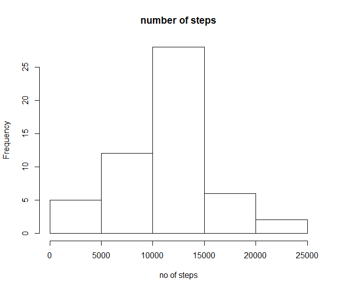
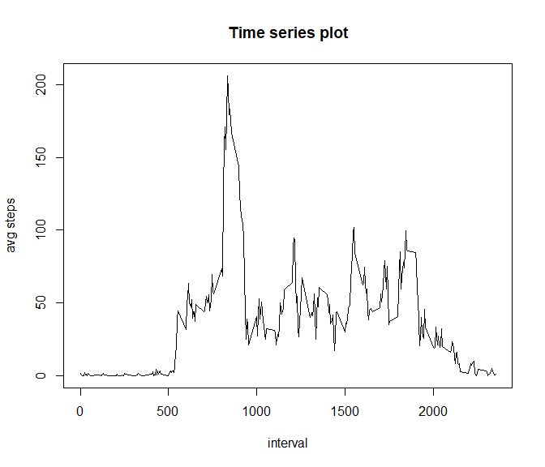
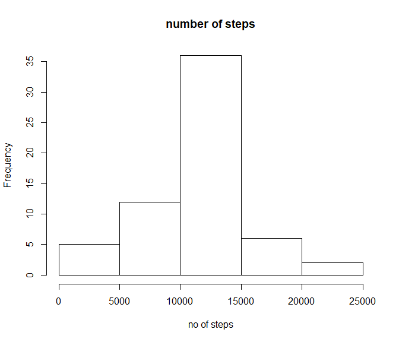
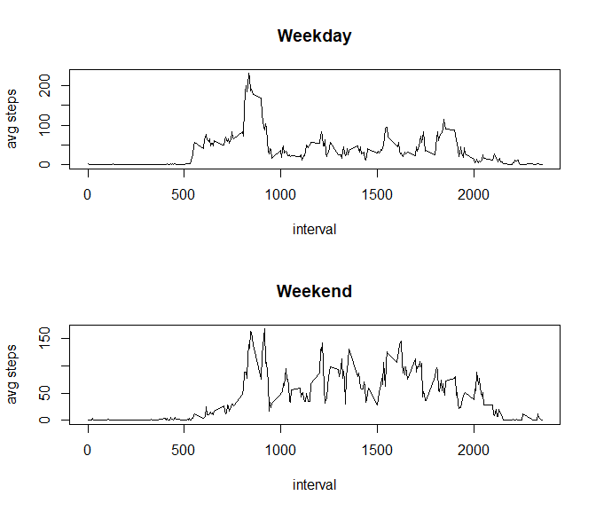

# Reproducible Research: Peer Assessment 1


## Loading and preprocessing the data

```r
	##load data and clean it
	dataf <- read.csv(file.choose()) ##select "activity.csv"
	dataf$date <- as.Date(dataf$date, format="%Y-%m-%d")
	datac <- na.omit(dataf)
	x <- aggregate(datac$steps, by=list(Category=datac$date), FUN=sum)
	x[,1] <- as.Date(x[,1])
```


## What is mean total number of steps taken per day?

```r
  hist(x[,2],xlab="no of steps",main="number of steps")
```

<!-- -->

```r
  meanx <- mean(x[,2])
	medianx <- median(x[,2])
	## mean and median
	print(meanx)
```

```
## [1] 10766.19
```

```r
	print(medianx)
```

```
## [1] 10765
```

```r
	## median: 10765
	##mean: 10766.19
```
## What is the average daily activity pattern?

```r
  datad <- na.omit(dataf)
  xx1 <- aggregate(datad$steps, by=list(Category=datad$interval), FUN=mean)
	xa1 <- xx1[,1]
	xb1 <- xx1[,2]
  print(max(xb1))
```

```
## [1] 206.1698
```

```r
	##max: 206.1698
```

```r
	plot(xa1,xb1,type="n",main="Time series plot",xlab="interval",ylab="avg steps")
	lines(xa1,xb1, type="l")
	lines(xa1,xb1)
```

<!-- -->
## Imputing missing values

```r
  datae <- dataf
  datae <-	na.omit(datae)
  datan <- dataf[is.na(dataf),]
  print("no of Na rows")
```

```
## [1] "no of Na rows"
```

```r
  print(nrow(datan)) ## number of NA rows
```

```
## [1] 2304
```

```r
	##2304
	jx <- aggregate(datae$steps, by=list(Category=datae$interval), FUN=mean,na.rm=T)
	for(i in 1:nrow(dataf)){
		if(is.na(dataf[i,1])){
			for(j in 1:nrow(jx)){
				if(identical(jx[j,1],dataf[i,3]))		
					dataf[i,1] <- jx[j,2]
			}	
		}
	}
	hx <- aggregate(dataf$steps, by=list(Category=dataf$date), FUN=sum)
	

	## mean and median of data with NAs replaced
	meanx <- mean(hx[,2])
	medianx <- median(hx[,2])
	##10766.19
	##10766.19
	print(medianx)
```

```
## [1] 10766.19
```

```r
	print(meanx)
```

```
## [1] 10766.19
```


```r
  hist(hx[,2],xlab="no of steps",main="number of steps")
```

<!-- -->
## Are there differences in activity patterns between weekdays and weekends?

```r
wkday <- c('Monday', 'Tuesday', 'Wednesday', 'Thursday', 'Friday')
	dataf$wday <- factor((weekdays(dataf$date) %in% wkday), 
         levels=c(FALSE, TRUE), labels=c('weekend', 'weekday'))
	
	xa2=dataf[dataf$wday=="weekday",]
	xb2=dataf[dataf$wday=="weekend",]
	ax2 <- aggregate(xa2$steps, by=list(Category=xa2$interval), FUN=mean,na.rm=T)
	bx2 <- aggregate(xb2$steps, by=list(Category=xb2$interval), FUN=mean,na.rm=T)
```

```r
	par(mfrow=c(2,1))
	plot(ax2[,1],ax2[,2],type="l",main="Weekday",xlab="interval",ylab="avg steps")
	plot(bx2[,1],bx2[,2],type="l",main="Weekend",xlab="interval",ylab="avg steps")
```

<!-- -->
